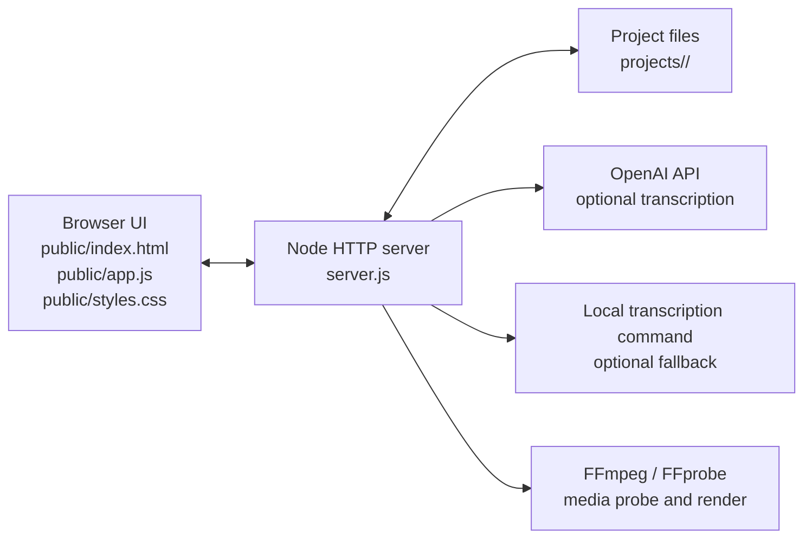
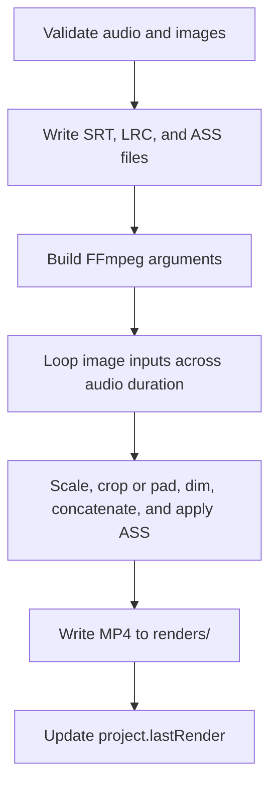

# iFunSong Developer Guide

This guide explains how iFunSong is structured internally, how data moves through the application, and where to make changes safely.

## Purpose

iFunSong is a local web app for creating MP4 lyric videos from:

- One audio file.
- One or more background images.
- Optional lyrics, either pasted, imported from LRC, extracted from metadata, transcribed, or aligned.
- Layout and subtitle styling options.

The app is intentionally simple: a Node.js HTTP server serves a static frontend, stores project data on disk, calls transcription providers when configured, and shells out to FFmpeg for final rendering.

## Runtime Architecture



There is no database, build step, frontend framework, or background worker. The single `server.js` process handles HTTP requests and file operations directly.

## Key Files

- `server.js`: Node HTTP server, API router, project persistence, media probing, transcription orchestration, subtitle generation, and FFmpeg rendering.
- `public/index.html`: Static HTML structure for the local app.
- `public/app.js`: Browser-side controller for state, uploads, lyric editing, style controls, preview updates, and API calls.
- `public/styles.css`: UI styling.
- `projects/`: Local project data, uploaded assets, generated subtitle files, and rendered videos.
- `samples/`: Example media.
- `docs/requirements.md`: Product requirements.
- `docs/implementation-plan.md`: Original implementation planning notes.

## Server Startup

The package entrypoint is:

```powershell
npm start
```

That runs:

```powershell
node server.js
```

By default, the server listens on `http://localhost:4173`. The port can be overridden with `PORT` or `--port=<number>`.

At startup, `server.js`:

1. Loads `.env` values.
2. Configures fetch networking for optional proxy or TLS settings.
3. Resolves FFmpeg and FFprobe paths from environment variables, npm packages, or `PATH`.
4. Ensures the `projects/` directory exists.
5. Starts a plain Node HTTP server.

## Frontend Flow

`public/app.js` is a browser-side controller. It keeps two pieces of client state:

- `state.project`: The currently open project.
- `state.projects`: The project list shown in the selector.

The frontend does not persist project data directly except for transcription preferences in `localStorage`. Project state is sent to the server through API calls.

Main responsibilities:

- Load and create projects.
- Upload audio and image files as base64 JSON payloads.
- Generate OpenAI image backgrounds from the current project title and/or lyrics.
- Read form controls into the active project object.
- Render the editable lyrics table.
- Parse imported LRC files.
- Trigger draft timing, extraction, alignment, and rendering requests.
- Update the preview and download links.

The UI is organized around three tabs:

- `Lyrics`: Raw lyrics, provider settings, timed lyric rows, SRT/LRC links.
- `Style`: Layout, image fit, subtitle styling, preview.
- `Render`: Text overlays and MP4 render action.

## Project Storage Layout

Each project is stored under `projects/<project-id>/`.

Typical layout:

```text
projects/
  project_<id>/
    project.json
    assets/
      audio/
        audio_<id>-song.mp3
      images/
        images_<id>-cover.jpg
    exports/
      lyrics.srt
      lyrics.lrc
      lyrics.ass
    renders/
      ifunsong-video.mp4
    tmp/
      transcribe_<id>.mp3
      local-transcript_<id>.json
```

`project.json` is the source of truth for project metadata. It contains:

- Project name and timestamps.
- Audio metadata and stored asset path.
- Image metadata and stored asset paths.
- Lyric mode, raw lyrics, timed lyrics, and optional word timings.
- Text overlays.
- Layout, style, and render settings.
- Last render output path when available.

File paths are validated with `ensureInside()` before reading or writing assets, which prevents API requests from escaping the project or public directories.

## API Surface

All API routes are implemented inside `handleApi()` in `server.js`.

| Method | Route | Purpose |
| --- | --- | --- |
| `GET` | `/api/health` | Reports FFmpeg, FFprobe, OpenAI, local transcription, proxy, and TLS status. |
| `POST` | `/api/openai/check` | Verifies an OpenAI API key by listing models. |
| `GET` | `/api/projects` | Lists saved projects. |
| `POST` | `/api/projects` | Creates a new project. |
| `GET` | `/api/projects/:id` | Reads one project. |
| `PUT` | `/api/projects/:id` | Saves project metadata, lyrics, layout, style, and render settings. |
| `POST` | `/api/projects/:id/audio` | Uploads audio, probes duration and metadata, and stores embedded lyrics if found. |
| `POST` | `/api/projects/:id/images` | Uploads images and records dimensions. |
| `POST` | `/api/projects/:id/images/generate` | Generates an OpenAI PNG background from project title and/or lyrics, then saves it as a project image. |
| `DELETE` | `/api/projects/:id/images/:imageId` | Removes an uploaded image. |
| `GET` | `/api/projects/:id/asset/*` | Serves a stored project asset. |
| `POST` | `/api/projects/:id/lyrics/draft` | Creates evenly spaced timings from pasted lyrics. |
| `POST` | `/api/projects/:id/lyrics/extract` | Uses embedded lyrics or transcription to generate timed lyrics. |
| `POST` | `/api/projects/:id/lyrics/align` | Transcribes audio and aligns pasted lyrics to segment timing. |
| `PUT` | `/api/projects/:id/lyrics` | Saves edited timed lyric rows. |
| `GET` | `/api/projects/:id/lyrics.srt` | Downloads generated SRT lyrics. |
| `GET` | `/api/projects/:id/lyrics.lrc` | Downloads generated LRC lyrics. |
| `POST` | `/api/projects/:id/render` | Renders the MP4 through FFmpeg. |
| `GET` | `/api/projects/:id/render/output` | Downloads the last rendered MP4. |

Non-API paths are served from `public/`. Unknown frontend paths fall back to `public/index.html`.

## Upload Pipeline

Audio and images are uploaded from the browser as base64 JSON payloads. The server:

1. Validates that each file has a name and data.
2. Sanitizes the original filename with `safeName()`.
3. Writes the file into `assets/audio/` or `assets/images/`.
4. Stores the project-relative path in `project.json`.

For audio uploads, `probeMedia()` calls FFprobe to read:

- Duration.
- Format name.
- Stream details.
- Metadata tags.

If metadata tags look like lyrics, the server stores them as `embeddedLyrics`.

For image uploads, `parseImageDimensions()` reads dimensions for PNG, JPEG, and WebP without invoking an external image library.

## Lyric Pipeline

iFunSong supports four lyric paths.

### Draft Timings

`splitLyricsToTimedLines()` spreads pasted lyric lines evenly across the audio duration. This is fast and does not need transcription.

### Embedded Lyrics

When audio metadata includes lyric-like tags, extraction can use that text immediately. If timing is not present, the app still creates even draft timings.

### OpenAI Transcription

`transcribeWithOpenAI()` sends audio to the configured OpenAI transcription endpoint.

Before upload, `prepareAudioForOpenAI()` checks whether the original audio is:

- In a supported OpenAI audio extension.
- Under the direct upload size limit.

If not, FFmpeg converts it to a temporary MP3 in `tmp/`, then deletes the temporary file after transcription.

### Local Transcription Command

`transcribeWithLocalCommand()` runs `LOCAL_TRANSCRIPTION_COMMAND` when configured. The command may include:

- `{audio}`: Replaced with the project audio path.
- `{output}`: Replaced with the expected JSON transcript output path.

The local command must write JSON with optional `text`, `segments`, and `words` fields.

### Alignment

`alignLyricLinesToSegments()` takes pasted lyric lines and transcript segments. It distributes transcript segment timing across the pasted lines based on word counts. This keeps the user's lyric text while borrowing approximate timing from transcription.

## Subtitle Generation

The server can generate three subtitle formats:

- SRT via `lyricsToSrt()`.
- LRC via `lyricsToLrc()`.
- ASS via `lyricsToAss()`.

SRT and LRC are downloadable user artifacts. ASS is used internally by FFmpeg to burn lyrics or text overlays into the final MP4.

ASS generation handles:

- Subtitle colors.
- Font size.
- Outline and shadow.
- Top, center, or bottom positioning.
- Optional karaoke highlighting with `\kf` timing tags.

## Render Pipeline

Rendering is handled by `renderProject()`.



`buildRenderArgs()` builds one FFmpeg command that:

1. Loops each image for a share of the audio duration.
2. Scales each image with either `cover` or `contain` behavior.
3. Applies background dimming.
4. Concatenates image clips.
5. Burns in ASS subtitles when lyrics or overlays exist.
6. Maps the audio stream.
7. Writes an H.264/AAC MP4 with fast-start metadata.

The render output path is stored as `project.lastRender.path`.

## Error Handling

The server uses `httpError(status, message, details)` to throw structured errors. `handleRequest()` catches all errors and responds with:

```json
{
  "error": "Message",
  "details": {}
}
```

The frontend `api()` helper converts non-OK responses into thrown errors. UI actions catch those errors through `showError()` or local `try/catch` blocks and display them in the status area.

## Configuration

Configuration is read from `.env`, process environment variables, or command-line arguments.

Important settings:

- `PORT`: Server port.
- `FFMPEG_PATH`: Optional explicit FFmpeg executable.
- `FFPROBE_PATH`: Optional explicit FFprobe executable.
- `OPENAI_API_KEY`: Optional server-side OpenAI API key.
- `OPENAI_API_BASE_URL`: OpenAI-compatible API base URL.
- `OPENAI_TRANSCRIPTION_MODEL`: Default transcription model.
- `OPENAI_TRANSCRIPTION_URL`: Full transcription endpoint override.
- `OPENAI_DIRECT_AUDIO_MAX_BYTES`: Direct upload size limit before conversion.
- `LOCAL_TRANSCRIPTION_COMMAND`: Optional local transcription command.
- `HTTPS_PROXY` or `HTTP_PROXY`: Optional outbound proxy.
- `OPENAI_CA_CERT` or `NODE_EXTRA_CA_CERTS`: Optional CA bundle path.
- `OPENAI_TLS_REJECT_UNAUTHORIZED`: Allows disabling TLS verification when set to `0`, `false`, or `no`.

Browser-side OpenAI credentials entered in the UI are stored only in that browser's `localStorage` and sent with transcription or test requests.

## Development Notes

- Keep `server.js` dependency-light unless a feature truly needs another package.
- Prefer project-relative paths in stored JSON and validate filesystem reads with `ensureInside()`.
- Keep `project.json` backward-compatible when adding fields; existing projects may not have new properties.
- When changing render behavior, inspect `buildRenderArgs()` and `lyricsToAss()` together because subtitle styling and FFmpeg filters are coupled.
- When changing frontend state, update both `pullFormIntoProject()` and `setProject()` if the value needs two-way syncing.
- Run syntax checks after JavaScript edits:

```powershell
npm run check
node --check public/app.js
```
